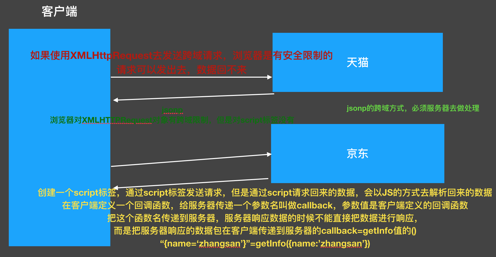
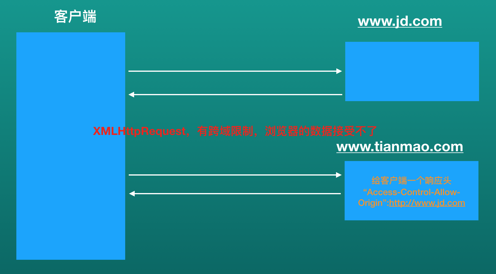
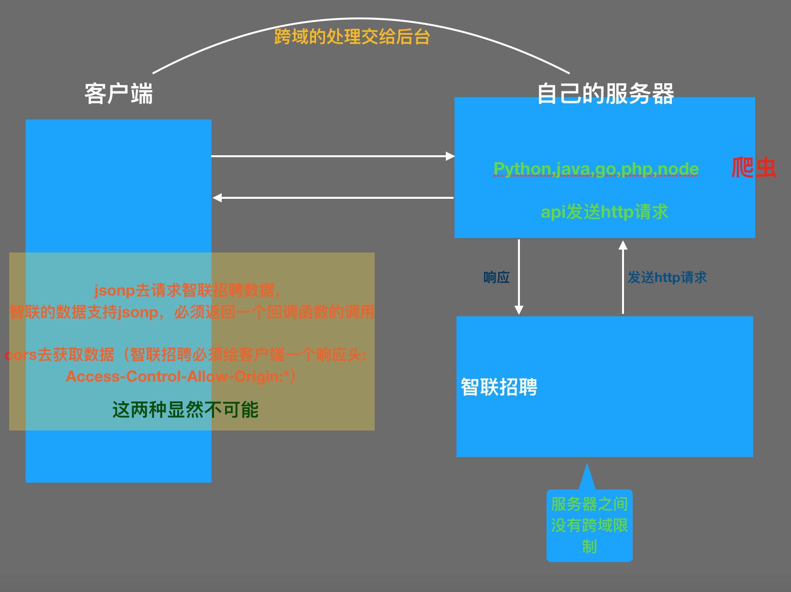

### jQuery ajax

> 封装了XMLHttpRequest对象，get post load getScript getJSON ajax

```html
<body>
  <!-- 
    前后端分离，客户端跟服务器进行交互的，数据都是通过ajax进行处理
    后台：
      1. 请求的地址
      2. 请求的参数，参数对应的要求说明
      3. 提交的方式
      4. 响应的数据格式的说明
  -->
  <input type="text" id="cityName"><br>
  <input type="button" name="" value="查询"><br>
  <table>
    <tr>
      <td>日期</td>
      <td>星期</td>
      <td>晚上最低温度</td>
      <td>白天最高温度</td>
      <td>风</td>
    </tr>
  </table>
</body>
<script>
  $(function () {
    $("input[type=button]").on("click", function () {
      var cityName = $("#cityName").val();
      $.ajax({
        url: "http://api.jisuapi.com/weather/query",
        type: "get",
        data: {
          appkey: "9457974d392dbfd5",
          city: cityName

        },
        dataType: "jsonp",
        success: function (data) {
          var weathers = data.result.daily;
          // console.log(weathers);
          // 解析json格式的数据
          var tr = "";
          for (var i = 0; i < weathers.length; i++) {
            tr += "<tr>";
            tr += "<td>" + weathers[i].date + "</td>";
            tr += "<td>" + weathers[i].week + "</td>";
            tr += "<td>" + weathers[i].night.templow + "</td>";
            tr += "<td>" + weathers[i].day.temphigh + "</td>";
            tr += "<td>" + weathers[i].day.winddirect + "</td>";
            tr += "</tr>";
          }
          // console.log(tr);
          $("table").append(tr);
        }
      })
    }) 
  })
</script>
```

### 模板引擎

模板作用: ajax开发一般都是通过XMLHttpRequest发送请求，然后服务器返回数据，当我们通过js 得到数据之后，然后通过解析json的方式去解析数据，解析完json之后，我们再将数据通过dom的方式放在页面上面。如果json的数据格式特别复杂，我们可能要做很多的js凭借，非常麻烦，性能也非常低下。这个时候我们就需要用到模板：我们可以在模板里面解析json，然后跟html内容拼接，性能会更好。

#### 流行模板引擎

**BaiduTemplate**: http://tangram.baidu.com/BaiduTemplate/  b百度

**ArtTemplate**: https://github.com/aui/artTemplate  t腾讯

**velocity.js**: https://github.com/shepherdwind/velocity.js/ a阿里

**Handlebars**: http://handlebarsjs.com/

**参考资料:**

http://blog.jobbole.com/56689/

#### **artTemplate**

1. 引入template-native.js

2. <% 与  %> 符号包裹起来的语句则为模板的逻辑表达式

3. <%= content %>为输出表达式

使用步骤:

- 引入模板文件
- 创建模板
- 将数据跟模板进行绑定
- 在模板里面编写代码解析数据
- 绑定数据和模板之后得到内容
- 将数据内容写到页面上面

### 跨域

从一个a站点获取一个页面，然后在这个页面去访问b站点的资源，所以就会产生跨域.

使用`XMLHttpRequest`对象去发送请求，就会有跨域的限制，浏览器限制.

使用script 标签发送请求，就不会有跨域限制

不同源则跨域

例如http://www.example.com/

| http://api.example.com/detail.html       | 不同源 | 域名不同       |
| :----------------------------------------: | :------: | :--------------: |
| https://www.example.com/detail.html       | 不同源 | 协议不同       |
| http://www.example.com:8080/detail.html  | 不同源 | 端口不同       |
| http://api.example.com:8080/detail.html  | 不同源 | 域名、端口不同 |
| https://api.example.com/detail.html      | 不同源 | 协议、域名不同 |
| https://www.example.com:8080/detail.html | 不同源 | 端口、协议不同 |
| http://www.example.com/detail/index.html | 同源   | 只是目录不同   |

#### jsonp

> 因为有了跨域的概念，在页面上通过XMLHttpRequest对象去请求跨域的数据，所以会出现数据拿不到的问题

利用`script`标签发送请求，在客户端定义一个回调函数，给服务器传递回调函数的名称，服务端返回的是一个回调函数的调用。服务端的数据包在函数里面.

**在页面除了使用XMLHttpRequest对象发送请求之外，还可以使用其他的属性或者标签**

其本质是利用了`<script src=""></script>`标签具有可跨域的特性，由服务端返回一个预先定义好的Javascript函数的调用，并且将服务器数据以该函数参数的形式传递过来，此方法需要前后端配合完成。

jQuery的`$.ajax()`方法当中集成了JSONP的实现，可以非常方便的实现跨域数据的访问。



jsonp的跨域，只支持`get`方式的请求，因为它是使用`script`标签去发送请求，而且服务端需要做处理，客户端也需要做处理。如果跨域的时候传递的数据非常多，jsonp的方式就不可取。

### cors跨域

> 跨域资源共享，原理就是在请求服务器的时候，服务器给一个响应头，告诉客户端这些数据可以访问



```
通过想客户端输出一个响应头
header("Access-Control-Allow-Origin:*");  跨域资源共享
```

这种方式是服务器直接可一个给定一个响应头`Access-Control-Allow-Origin`，告诉客户端浏览器，这些数据可以获取。这个`Access-Control-Allow-Origin`也是属于`http`协议规定的.

### jsonp 与 core 的区别

`jsonp`是最早期的跨域解决方案，因为使用`script`标签发送请求，所以兼容性会比较好，只支持`get`方式。
`cors`是后期是后期的一种解决方案. 它只需要改服务器的配置，客户端不需要做任何的处理。一个响应. ,兼容性稍微差一些，因为`Access-Control-Allow-Origin`是后期`http`协议规定的，如果浏览器不支持这个响应头,就不能用这种方式。支持`get`，以及`post`

