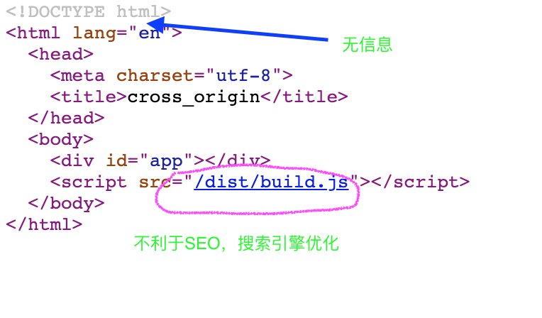

### mixin

> 将公共的行为：混入(杂交)
> 发请求C的行为混入到组件A和B之中
> 将行为混入到所有组件中

#### hash

1. 安装插件的时候监听`hashchange`事件，监视`_route`
2. 处理`routes`获取到path关联组件
3. 等待`hashchange`触发，匹配`routes`中的数据，最终得到`matched`赋值给`_route`
4. 触发了`_route`的监视行为，`router-view`这个组件此时获取到`_route`，来作为渲染的内容


#### history模式

* 只有调用go||forward函数，才会根据历史记录也换页面
* 切换的过程会触发popstate事件

* 如果不希望看到丑陋的 # 可以使用history模式 ， 其原理依赖于`history.pushState`函数
* a标签点击以后，如果没有#必然会页面跳转发起请求
* 使用`pushState`函数可以改变url, 比如`/abc`而不会发起请求
* js通过`location.pathname`获取该值`/abc`做页面局部的替换


#### 多页应用

- 核心思想: 其实就是两个vue项目，一次webpack打包，关联用url联系
  - webpack操作:
    1. 多个入口 {  main1:'./usermain.js',main2:'./goodsmain.js'  }
    2. 多个html插件
- getHtmls的思路
  - 更为灵活的读取各项目下的js文件（入口）  entry:{‘js文件名’:'js文件路径' } 
  - 更为灵活的读取各项目下的html文件（首页.html） `plugins:[].concat([new HtmlWebpackPlugin(),new HtmlWebpackPlugin()])`
    - filename属性是生成的相对dist的文件名  xxx.html
    - template 模板生成的参照物  需要绝对路径||相对路径 './xxx.html'
    - chunks:[filename]   指定第三引入的js文件名称
      - 这个[name]其实就是entry的key
- 解决首页: `开发环境配置--open-page xxx.html   生产环境配置 server节点`

#### 处理前后端分离带来的跨域问题

> webpack.config.js(dev)

```js
devServer: {
  historyApiFallback: true,
  noInfo: true,
  overlay: true,
  proxy: {
    '/api': {
      target: 'https://list.jd.com/list.html?cat=1318,1462,1480&callback=jQuery942326&md=9&l=jdlist&go=0',
      pathRewrite: {'^/api': ''},
      changeOrigin: true
    }
  }
}
```

#### 预渲染

> 单页应用，首先加载index.html



> 在单页中预先渲染部分，静态数据，不变化的页面.比如关于我这样的页面


#### 总结

* 骨架屏的webpack插件编写，apply函数可以参与webpack插件的执行
  * plugin('编译')
    * 操作文件 `assers[''文件名'] = { source内容函数, size大小函数}`
  * 介入其他插件留下的事件函数
  * webpack按顺序执行
* 多页应用
  * 多个单页应用
    * js入口多入口
    * html插件做多插件
      * 配置其不同的`filename`和`template`属性
      * `chunks`描述各自引入的资源
* 预渲染是再SPA中可以解决局部页面的SEO问题
  * 提前生成页面，URL匹配直接返回该页面
  * 生成`about.html`页面  该页面SEO 得到优化 `/about`
* 跨域
  * 开发`webpack proxy-middleware`代理