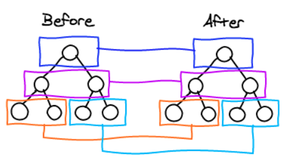

### v-for 中 key 的作用

要知道，不仅只是 vue 中，react 中在执行列表渲染时也会要求给每个组件添加 key 这个属性

如果想知道 key 的作用，不得得聊一下虚拟 DOM 的 Diff 算法

所谓虚拟 DOM 的诞生，使我们可以不直接操作 DOM 元素，只操作数据便可以重新渲染页面。而隐藏在背后的原理便是其高效的 Diff 算法，它的核心是基于两个简单的假设：

1. 两个相同的组件产生类似的 DOM 结构，不同的组件产生不同的 DOM 结构
2. 同一个层级的一组节点，他们可以通过唯一的 id 进行区分



由此图我们可以看出：

当页面的数据发生变化时，Diff 算法只会比较同一层级的节点：

**如果节点类型不同，直接干掉前面的节点，再创建并插入新的节点，不会再比较这个节点以后的子节点了**

**如果节点类型相同，则会重新设置该节点的属性，从而实现节点的更新**

当某一层有很多相同的界定啊时，也就是列表节点，Diff 算法的更新过程默认情况下也是遵循以上原则

比如下面这个情况


希望可以在 B 和 C 之间加一个 F,Diff 算法默认 执行起来是这样的：


既把 C 更新成 F,D 更新成 C,E 更新成 D,最后再插入 E,是不是很没有效率？

所有**需要使用 key 来给每个节点做一个唯一的标识，Diff 算法就可以正确的识别此节点，找到正确的位置区插入新的节点**


所以一句话，**key 的作用主要是为了高效的更新虚拟 DOM**。另外 vue 的在使用相同标签名元素的过渡切换时，也会使用到 key 属性，其目的也是为了让 vue 可以区分他们，否则 vue 只会替换其内部属性而不会触发过渡效果。

### $emit和$on 进行组件之间的传值

> 注意：`$emit`和`$on`的事件必须在一个公共的实例上，才能够触发

需求：

1. 有 A，B，C 三个组件，同时挂载到入口组件中
2. 将 A 组件中的数据传递到 C 组件，再将 B 组件中的数据传递到 C 组件

```js
var Event = new Vue();
var A = {
  data() {
    return {
      a: "我是a组件中的数据"
    };
  },
  template: `<div>
        <span>我是A组件的数据->{{a}}</span>  
        <input type="button" value="把A数据传给C" @click="send" />
      </div>`,
  methods: {
    send() {
      // $emit('事件名字',数据)
      console.log(this);
      Event.$emit("a-msg", this.a);
    }
  }
};
var B = {
  data() {
    return {
      b: "我是b组件中的数据"
    };
  },
  template: `<div>
        <span>我是A组件的数据->{{b}}</span>  
        <input type="button" value="把B数据传给C" @click="send" />
      </div>`,
  methods: {
    send() {
      // $emit('事件名字',数据)
      console.log(this);
      Event.$emit("b-msg", this.b);
    }
  }
};
var C = {
  data() {
    return {
      a: "",
      b: ""
    };
  },
  template: `<div>
        <h3>我是C组件</h3>
        <span>接受A组件的数据为：{{a}}</span>
        <br/>
        <span>接受B组件的数据为：{{b}}</span>
      </div>`,
  mounted() {
    // 接受A中的数据
    Event.$on("a-msg", a => {
      this.a = a;
    });
    Event.$on("b-msg", b => {
      this.b = b;
    });
  }
};
new Vue({
  el: "#app",
  components: {
    "dom-a": A,
    "dom-b": B,
    "dom-c": C
  }
});
```

### vue-cli2.x 脚手架的使用

目前可用的模块包括：

- [webpack](https://github.com/vuejs-templates/webpack) - 一个功能齐全的 Webpack + vue-loader 设置，具有热重载，linting，测试和 css 提取功能。
- [webpack-simple](https://github.com/vuejs-templates/webpack-simple) - 一个简单的 Webpack + vue-loader 设置，用于快速原型设计。
- [browserify](https://github.com/vuejs-templates/browserify) -全功能 Browserify + vueify 设置用热重装载，linting＆单元测试。
- [browserify-simple](https://github.com/vuejs-templates/browserify-simple) - 一个简单的 Browserify + vueify 设置，用于快速原型设计。
- [pwa](https://github.com/vuejs-templates/pwa) - 基于 webpack 模板的 vue-cli 的 PWA 模板
- [simple](https://github.com/vuejs-templates/simple) - 单个 HTML 文件中最简单的 Vue 设置


### vue-cli3x 脚手架的使用

```js
// vue.config.js 配置说明
//官方vue.config.js 参考文档 https://cli.vuejs.org/zh/config/#css-loaderoptions
// 这里只列一部分，具体配置参考文档
module.exports = {
  // 部署生产环境和开发环境下的URL。
  // 默认情况下，Vue CLI 会假设你的应用是被部署在一个域名的根路径上
  //例如 https://www.my-app.com/。如果应用被部署在一个子路径上，你就需要用这个选项指定这个子路径。例如，如果你的应用被部署在 https://www.my-app.com/my-app/，则设置 baseUrl 为 /my-app/。
  baseUrl: process.env.NODE_ENV === "production" ? "./" : "/",

  // outputDir: 在npm run build 或 yarn build 时 ，生成文件的目录名称（要和baseUrl的生产环境路径一致）
  outputDir: "dist",
  //用于放置生成的静态资源 (js、css、img、fonts) 的；（项目打包之后，静态资源会放在这个文件夹下）
  assetsDir: "assets",
  //指定生成的 index.html 的输出路径  (打包之后，改变系统默认的index.html的文件名)
  // indexPath: "myIndex.html",
  //默认情况下，生成的静态资源在它们的文件名中包含了 hash 以便更好的控制缓存。你可以通过将这个选项设为 false 来关闭文件名哈希。(false的时候就是让原来的文件名不改变)
  filenameHashing: false,

  //   lintOnSave：{ type:Boolean default:true } 问你是否使用eslint
  lintOnSave: true,
  //如果你想要在生产构建时禁用 eslint-loader，你可以用如下配置
  // lintOnSave: process.env.NODE_ENV !== 'production',

  //是否使用包含运行时编译器的 Vue 构建版本。设置为 true 后你就可以在 Vue 组件中使用 template 选项了，但是这会让你的应用额外增加 10kb 左右。(默认false)
  // runtimeCompiler: false,

  /**
   * 如果你不需要生产环境的 source map，可以将其设置为 false 以加速生产环境构建。
   *  打包之后发现map文件过大，项目文件体积很大，设置为false就可以不输出map文件
   *  map文件的作用在于：项目打包后，代码都是经过压缩加密的，如果运行时报错，输出的错误信息无法准确得知是哪里的代码报错。
   *  有了map就可以像未加密的代码一样，准确的输出是哪一行哪一列有错。
   * */
  productionSourceMap: false,

  // 它支持webPack-dev-server的所有选项
  devServer: {
    host: "localhost",
    port: 1111, // 端口号
    https: false, // https:{type:Boolean}
    open: true, //配置自动启动浏览器
    // proxy: 'http://localhost:4000' // 配置跨域处理,只有一个代理

    // 配置多个代理
    proxy: {
      "/api": {
        target: "<url>",
        ws: true,
        changeOrigin: true
      },
      "/foo": {
        target: "<other_url>"
      }
    }
  }
};
```

### RESTful

##### RESTful 规范

一种软件的架构风格，设计风格，而不是标准，为客户端和服务端的交互提供一组设计原则和约束条件。

##### 一 面向资源编程

每个 URL 代表一种资源，URL 中尽量不要用动词，要用名词，往往名词跟数据库表格相对应。

​一般来说，数据库中的表都是同种记录的集合，所有 API 中的名词也应该使用复数。

​举例来说，有一个 API 提供动物园（zoo）的信息，还包括各种动物和雇员的信息，则它的路径应该设计成下面这样。

```js
https://api.example.com/v1/zoos
https://api.example.com/v1/animals
https://api.example.com/v1/employees
```

##### 二 HTTP 动词

​对于资源的具体操作类型，由 HTTP 动词表示

​常用的 HTTP 动词有下面五个(括号里对应的 sql 命令)

```js
GET（SELECT）：从服务器取出资源（一项或多项）。
POST（CREATE）：在服务器新建一个资源。
PUT（UPDATE）：在服务器更新资源（客户端提供改变后的完整资源）。
PATCH（UPDATE）：在服务器更新资源（客户端提供改变的属性）。
DELETE（DELETE）：从服务器删除资源。
```

##### 三 在 URL 中体现版本

https://www.bootcss.com/v1/

https://v1.bootcss.com/

##### 四 在 URL 中体现是否是 API

https://www.bootcss.com/api/mycss

https://api.bootcss.com/mycss

##### 五 在 URL 中的过滤条件

​ 如果记录数量很多，服务器不可能都将它们返回给用户。API 应该提供参数，过滤返回结果。

```js
?limit=10：指定返回记录的数量
?offset=10：指定返回记录的开始位置。
?page=2&per_page=100：指定第几页，以及每页的记录数。
?sortby=name&order=asc：指定返回结果按照哪个属性排序，以及排序顺序。
?animal_type_id=1：指定筛选条件
```

##### 六 尽量使用 HTTPS

https://www.bootcss.com/v1/mycss

##### 七 响应时设置状态码

1\*\* 信息，服务器收到请求，需要请求者继续执行操作

2\*\* 成功，操作被成功接收并处理

3\*\* 重定向，需要进一步的操作以完成请求

4\*\* 客户端错误，请求包含语法错误或无法完成请求

5\*\* 服务器错误，服务器在处理请求的过程中发生了错误

##### 八 返回值

GET 请求 返回查到所有或单条数据

POST 请求 返回新增的数据

PUT 请求 返回更新数据

PATCH 请求 局部更新 返回更新整条数据

DELETE 请求 返回值为空

##### 九 返回错误信息

如果状态码是 4xx，就应该向用户返回出错信息。一般来说，返回的信息中将 error 作为键名，出错信息作为键值即可。

```js
{
  error: "Invalid API key";
}
```

##### 十 Hypermedia API

如果遇到需要跳转的情况 携带调转接口的 URL

Hypermedi API 的设计,比如 github 的 API 就是这种设计，访问 api.github.com 会得到一个所有可用的 API 的网址列表。

```js
{
  "current_user_url": "https://api.github.com/user",
  "authorizations_url": "https://api.github.com/authorizations",
  // ...
}
```

从上面可以看到，如果想获取当前用户的信息，应该去访问 api.github.com/user，就会得到下面的记过

```js
{
message: "Requires authentication",
documentation_url: "https://developer.github.com/v3/users/#get-the-authenticated-user"
}
```

##### 十一 其他

（1）API 的身份认证应该使用 OAuth 2.0 框架

（2）服务器返回的数据格式，应该尽量使用 JSON，避免使用 XML
