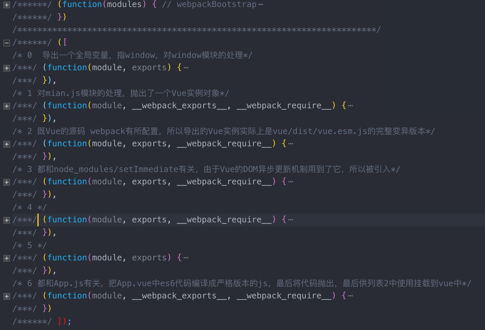

### webpack打包模块的源码 执行顺序

1. 把所有模块的代码放入到函数中，用一个数组保存起来
2. 根据require时传入的数组索引，能知道需要哪一段代码
3. 从数组中，根据索引取出包含代码的函数
4. 执行该函数，传入一个对象module.exports
5. 我们的代码，按照约定，正好是用module.exports = 'xxx'进行赋值
6. 调用函数结束后，module.exports从原来的空对象，就有值了
7. 最终return module.exports;作为require函数的返回值

> webpack编译之后的build.js文件解读



### css-loader

webpack需要loaders处理这些文件

`npm i css-loader style-loader -D`

```js
module: {
  loaders: [{
    // 遇到后缀为.css文件，webpack先用css-loader加载器去解析这个文件
    // 最后计算完的css，将会使用style-loader生成一个内容为最终解析完的css代码的style标签，放到head标签里
    // webpack在打包过程中，遇到css的文件，就会使用style-loader和css-loader去加载这个文件
    test: /\.css$/,
    loader: 'style-loader!css-loader'
  }]
}
```

### 对图片的处理

`npm i url-loader file-loader -D`

添加loader的配置

```js
module: {
  loaders: [{
    test: /\.css$/,
    loader: 'style-loader!css-loader'
  }, {
    test: /\.(jpg|png|jpeg|gif|svg)$/,
    loader: 'url-loader?limit=4000'
  }]
}
```

### html-webpack-plugin插件的使用

`npm i html-webpack-plugin --save-dev`

```js
const path = require('path');
const HtmlWebpackPlugin = require('html-webpack-plugin');
// webpack ./main.js  ./build.js
module.exports = {
	// 入口
	entry: {
		// 可以有多个入口，也可以有一个，如果有一个就默认从这一个入口开始分析
		"main": './src/main.js'
	},
	output: {
		path: path.resolve('./dist'),  // 相对转绝对
		filename: 'build.js'
	},
	watch: true, //文件监视改动 自动产出build.js
	// 声明模块
	// 包含各个loader
	module: {
		loaders: [{
				// /遇到后缀为.css的文件，webpack先用css-loader加载器去解析这个文件
				// 最后计算完的css，将会使用style-loader生成一个内容为最终解析完的css代码的style标签，放到head标签里。
				// webpack在打包过程中，遇到后缀为css的文件，就会使用style-loader和css-loader去加载这个文件。
				test: /\.css$/,
				loader: 'style-loader!css-loader'
			},
			{
				test: /\.(jpg|png|jpeg|gif|svg)$/,
				loader: 'url-loader?limit = 60000'
			},
			{
				test: /\.less$/,
				loader: 'style-loader!css-loader!less-loader'
			}
		]
	},
	// 添加插件
	plugins: [
		// 插件的执行顺序与元素索引有关
		new HtmlWebpackPlugin({
			template: './src/index.html' // 参照物
		})
	]
}
```

### webpack-dev-server

`npm install webpack-dev-server --save-dev`

> 常用配置参数

1. --open 自动打开浏览器
2. --hot 热更新，不在刷新的情况下替换css样式
3. --inline 自动刷新
4. --port 9999 指定端口
5. --process 显示编译进度

在package.json中配置

```js
"scripts": {
  "dev": "webpack-dev-server --open --hot --inline --config ./webpack.dev.config.js",
  "prod": "webpack --config ./webpack.prod.config.js"
}
```

### es6的解析

`babel-core`

> 作用是把js代码分析成ast(抽象语法树)，方便各个插件分析语法进行相应的处理。有些新语法在低版本js中是不存在的，如箭头函数，rest参数，函数默认值等，这种语言层面的不兼容只能通过将代码转为ast，分析其语法后再转为低版本的js
> babel转义器本身，提供了babel的转义API，如`babel.transform`等，用于对代码进行转义，webpack中的babel-loader就是调用这些API来完成转义过程的

`babel-loader`

> 在将ES6的代码transform进行转义，就是通过babel-loader来完成的

`babel-preset-env`

> 如果要自行配置转义过程中使用的各类插件，那太麻烦了。babel官方提供了一些预设的插件集，称之为preset。以JS标准为例，babel提供了如下的一些preset：es2015, es2016, es2017, env(最新的版本)

`babel-plugin-transform-runtime`

> babel编译时只转换语法，几乎所有的编译新的JavaScript语法，但不会转化DOM里面不兼容的API，如Promise，Set，Symbol，Array.from，async等一些API

