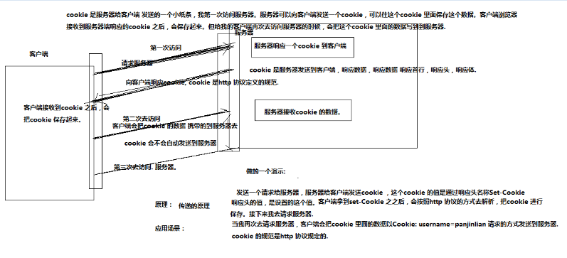

### 常见的状态码

- 200 OK
- 403 没有权限访问
- 404 请求的资源没有找到
- 304 后端的文件的没有任何的改变
- 302 重定向
- 500 服务器内部错误

### MySQL的使用

#### 创建数据库表

```sql
CREATE TABLE table_name
(
    field1  datatype,
    field2  datatype,
    field3  datatype,
)
```

#### 查看数据表

查看当前数据库中的所有表。

```sql
show tables;
```

查看表结构

```sql
desc table_name;
```

查看建表语句

```sql
show create table table_name;
```

#### 删除数据表

```sql
DROP TABLE table_name;
```

### 表的约束

为了防止数据表中插入错误的数据，在MySQL中，定义了一些维护数据库完整性的规则，即表的约束。

约束是用来约束每一列的整个数据的，保证这个数据的完整性。

| 约束条件    | 说明                             |
| ----------- | -------------------------------- |
| PRIMARY KEY | 主键约束，用于唯一标识对应的记录 |
| FOREIGN KEY | 外键约束                         |
| NOT NULL    | 非空约束                         |
| UNIQUE      | 唯一性约束                       |
| DEFAULT     | 默认值约束，用于设置字段的默认值 |

表的约束条件都是针对表中字段进行限制，从而保证数据表中数据的正确性和唯一性。

### 数据处理

#### 增加数据

```sql
INSERT INTO table_name VALUES(value1,value2,value3...);

INSERT INTO employee(username,PASSWORD,loginName) VALUES('风之子','111111','xiaoxuanfeng@kaikeba.com');
```

#### 修改数据

```sql
UPDATE table_name     SET col_name1=expr1 , col_name2=expr2  where condition;
UPDATE employee SET username='caidaguanren' WHERE id=2;
```

#### 删除数据

```sql
delete from** table_name  [WHERE where_definition];
DELETE FROM employee WHERE id =1;
```

#### 查询数据

```sql
SELECT [DISTINCT] *|{colum1, colum2, colum3...} FROM table_name;
SELECT指定查询哪些列的数据
column指定列名
* 号表示查询所有列
FROM 指定查询哪种表
DISTINCT 可选，指查询结果时，是否去除重复数据
SELECT COUNT(*) FROM employee; 统计某张表里面的数据的数量
SELECT * FROM employee
SELECT * FROM employee  where columnName= value;
```

### cookie

### cookie 概念

什么是Cookies（“小甜饼”）呢？简单来说，Cookies就是服务器暂时存放在你的电脑里的资料（.txt格式的文本文件），好让服务器用来辨认你的计算机。当你在浏览网站的时候，Web服务器会先送一小小资料放在你的计算机上，Cookies 会把你在网站上所打的文字或是一些选择都记录下来。当下次你再访问同一个网站，Web服务器会先看看有没有它上次留下的Cookies资料，有的话，就会依据Cookie里的内容来判断使用者，送出特定的网页内容给你。 



服务端：怎么发送cookie (setcookie() 函数用于设置 cookie );

```js
setcookie("user", "Alex Porter", time()+3600); // 服务端向客户端设置cookie
```

客户端：怎么获取cookie

```js
var cookies=document.cookie;
```

### cookie生命周期

> 给服务器发送请求，服务器发送cookie，客户端得到cookie之后保存多久，怎么保存
> 
#### 三种类型的cookie

##### 内存cookie

> 服务器给客户端发送一个cookie，这个cookie保存在客户端浏览器的内存当中，当关闭浏览器，cookie就会消失

```js
setcookie("user", "zhuwu");  //如果不设置时间，默认就是内存cookie ，当浏览器关闭，客户端会把cookie 清空，整个周期在浏览器的内存当中。
```

##### 硬盘cookie

> 服务器给客户端发送一个cookie，这个cookie保存在用户的硬盘上面，当关闭浏览器，重启电脑，cookie还在

```js
//设置当前cookie 的时间为一天。
setcookie("user", "fengzi", time() + 3600 * 24);
```

##### 追杀cookie

```js
//把cookie 的value 设置为空，失效时间改成-1 这样即是追杀cookie，把客户端成cookie 清楚。
setcookie("user", "", -1);
```

### 具体作用:

`http`协议是基于请求响应的协议，请求-->响应，连接断开。没有办法记录客户端的状态。也就没有办法对用户的行为进行跟踪，我们可以根据`cookie`对用户进行状态的跟踪,。

cookie流程：当第一次访问服务器，服务器可以向客户端发送cookie，可以往cookie 当中存入需要的数据。

客户端如果接收到服务器端响应的cookie，会把cookie自动保存起来。当客户端再次请求服务器的时候，

浏览器会自动把客户端cookie 的数据发送到服务器。