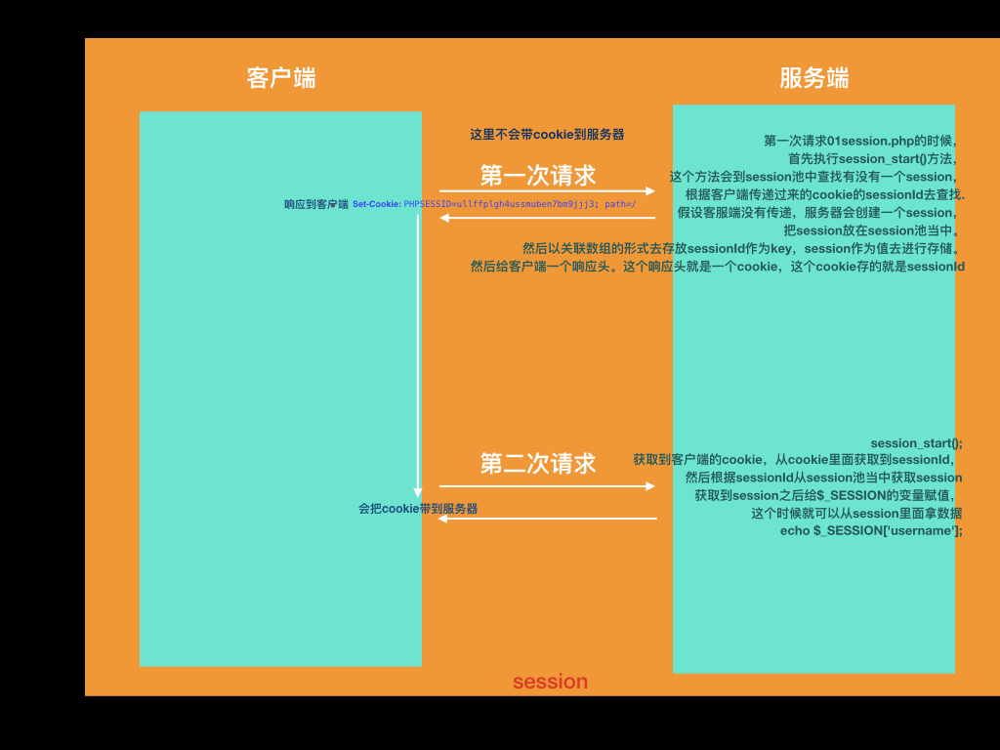
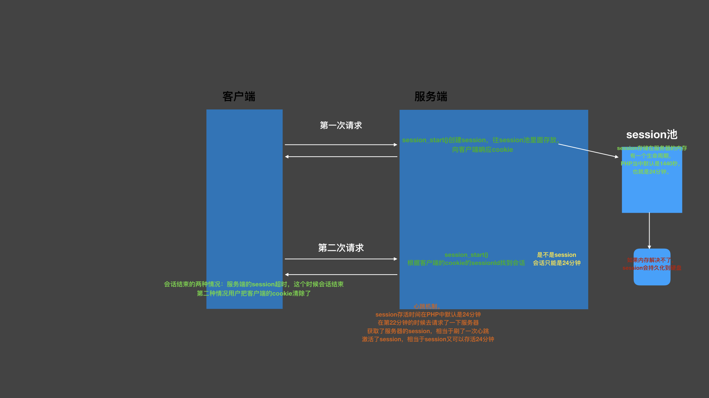
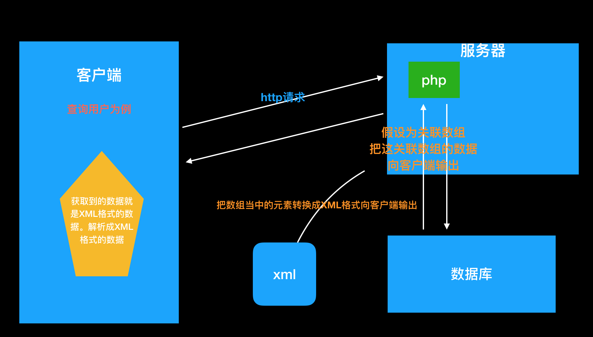

### 常见的状态码

- 200 OK
- 403 没有权限访问
- 404 请求的资源没有找到
- 304 后端的文件的没有任何的改变
- 302 重定向
- 500 服务器内部错误

### MySQL 的使用

**我们的数据是面向表存储的，数据库表格式用来存储数据的，这个我们现实当中的表一样，我们首先需要定义表当中有多少列，然后我们可以往表当中添加一条一条的记录。我们在定义一张表的列时，我们需要先根据需求对这张表进行设计，设计一般主要是设计表当中有哪些列，这一列对应的名称是什么，它所存放的数据类型是什么，这个我们也称为表结构的设计。所以在学习表的设计之前，我们需要学习表的一些相关知识.**

#### 创建数据库表

```sql
CREATE TABLE table_name
(
    field1  datatype,
    field2  datatype,
    field3  datatype,
)
```

#### 查看数据表

查看当前数据库中的所有表。

```sql
show tables;
```

查看表结构

```sql
desc table_name;
```

查看建表语句

```sql
show create table table_name;
```

#### 删除数据表

```sql
DROP TABLE table_name;
```

### 表的约束

为了防止数据表中插入错误的数据，在 MySQL 中，定义了一些维护数据库完整性的规则，即表的约束。

约束是用来约束每一列的整个数据的，保证这个数据的完整性。

| 约束条件    | 说明                             |
| ----------- | -------------------------------- |
| PRIMARY KEY | 主键约束，用于唯一标识对应的记录 |
| FOREIGN KEY | 外键约束                         |
| NOT NULL    | 非空约束                         |
| UNIQUE      | 唯一性约束                       |
| DEFAULT     | 默认值约束，用于设置字段的默认值 |

表的约束条件都是针对表中字段进行限制，从而保证数据表中数据的正确性和唯一性。

### 数据处理

#### 增加数据

```sql
INSERT INTO table_name VALUES(value1,value2,value3...);

INSERT INTO employee(username,PASSWORD,loginName) VALUES('风之子','111111','xiaoxuanfeng@kaikeba.com');
```

#### 修改数据

```sql
UPDATE table_name     SET col_name1=expr1 , col_name2=expr2  where condition;
UPDATE employee SET username='caidaguanren' WHERE id=2;
```

#### 删除数据

```sql
delete from** table_name  [WHERE where_definition];
DELETE FROM employee WHERE id =1;
```

#### 查询数据

```sql
SELECT [DISTINCT] *|{colum1, colum2, colum3...} FROM table_name;
SELECT指定查询哪些列的数据
column指定列名
* 号表示查询所有列
FROM 指定查询哪种表
DISTINCT 可选，指查询结果时，是否去除重复数据
SELECT COUNT(*) FROM employee; 统计某张表里面的数据的数量
SELECT * FROM employee
SELECT * FROM employee  where columnName= value;
```

### cookie

### cookie 概念

什么是 Cookies（“小甜饼”）呢？简单来说，Cookies 就是服务器暂时存放在你的电脑里的资料（.txt 格式的文本文件），好让服务器用来辨认你的计算机。当你在浏览网站的时候，Web 服务器会先送一小小资料放在你的计算机上，Cookies 会把你在网站上所打的文字或是一些选择都记录下来。当下次你再访问同一个网站，Web 服务器会先看看有没有它上次留下的 Cookies 资料，有的话，就会依据 Cookie 里的内容来判断使用者，送出特定的网页内容给你。


服务端：怎么发送 cookie (setcookie() 函数用于设置 cookie );

```js
setcookie("user", "Alex Porter", time() + 3600); // 服务端向客户端设置cookie
```

客户端：怎么获取 cookie

```js
var cookies = document.cookie;
```

### cookie 生命周期

> 给服务器发送请求，服务器发送 cookie，客户端得到 cookie 之后保存多久，怎么保存

#### 三种类型的 cookie

##### 内存 cookie

> 服务器给客户端发送一个 cookie，这个 cookie 保存在客户端浏览器的内存当中，当关闭浏览器，cookie 就会消失

```js
setcookie("user", "zhuwu"); //如果不设置时间，默认就是内存cookie ，当浏览器关闭，客户端会把cookie 清空，整个周期在浏览器的内存当中。
```

##### 硬盘 cookie

> 服务器给客户端发送一个 cookie，这个 cookie 保存在用户的硬盘上面，当关闭浏览器，重启电脑，cookie 还在

```js
//设置当前cookie 的时间为一天。
setcookie("user", "fengzi", time() + 3600 * 24);
```

##### 追杀 cookie

```js
//把cookie 的value 设置为空，失效时间改成-1 这样即是追杀cookie，把客户端成cookie 清楚。
setcookie("user", "", -1);
```

### 具体作用:

`http`协议是基于请求响应的协议，请求-->响应，连接断开。没有办法记录客户端的状态。也就没有办法对用户的行为进行跟踪，我们可以根据`cookie`对用户进行状态的跟踪,。

cookie 流程：当第一次访问服务器，服务器可以向客户端发送 cookie，可以往 cookie 当中存入需要的数据。

客户端如果接收到服务器端响应的 cookie，会把 cookie 自动保存起来。当客户端再次请求服务器的时候，

浏览器会自动把客户端 cookie 的数据发送到服务器。

### session

#### 概念

```
session代表的就是一次会话。会话在我们的现实过程当中有很多，
比如拨打10086，在10086，当10086接通时，代表我的会话开始，中间我可能发送多次动作交谈，直至挂断，会话结束。整个会话过程当中，我们可能会发送多次请求。由多次请求组成一次会话。(一个会话由多次请求组成)
web会话
    那什么代表网站会话，可以这么理解，打开网站，访问网站时会话开始，在这个网站当中可能发送多次请求，直至关闭浏览器会话结束。这整个过程当中我们可以理解成一次会话.`http`协议是基于请求响应的，无状态的，一次会话当中包含多个请求，每个请求都是相互独立的，会话当中包含多个请求，需要在请求之间共享数据，所以这个时候就需要使用到会话。
    一个网站的会话由多次http请求组成，http请求是无状态的，是基于请求响应的，每个请求又都是相互独立的
一次会话范围内要进行数据的共享，每个请求都是独立，就不能进行数据的共享。
无状态：请求-->响应 连接断开。要在一个会话范围内进行数据共享，这个时候就需要使用session.
```



> web 会话并不是浏览器开始访问一个网站，会话就开始了，而是服务器创建了 session，然后向客户端响应了一个 cookie，cookie 里面保存了 sessionId，这个时候会话开始，关闭浏览器会话也不会结束。服务器端的 session 没有了，会话就会结束。
> 第二种情况，客户端的 cookie 没有了，会话也会结束。因为 session 是依赖 cookie 的。



#### cookie 与 session 对比

cookie
是存储在客户端，它是服务器想客户端保存数据。记住用户名。

sessionStroage
客户端的存储，基于 html5 ，也是本地存储。生命周期。

localstorage
本地存储，它是实例化到本地的硬盘。

session
存储在服务器的，依赖 cookie。

### ajax

> 同步交互：客户端给服务器发送请求，服务器给客户端一个响应，响应回来的数据会把客户端的界面给覆盖，这种交互就是同步交互

> 异步交互：客户端给服务器发送请求，服务器给客户端一个响应，响应回来的数据不会把客户端的界面覆盖掉

**ajax 概念**：ajax 就是实现页面不刷新，可以直接获取服务器端数据

```js
var xhr = new XMLHttpRequest();
xhr.open("post", "post.php");
// post提交需要发送特殊的请求头到服务器
// Content-Type:application/x-www-form-urlencoded
// 通过客户端XMLHTTPRequest把这个头发送到服务器，服务器才能进行解析
xhr.setRequestHeader("Content-Type", "application/x-www-form-urlencoded");
xhr.send("username=liyang");
xhr.onreadystatechange = function() {
  if (xhr.readyState == 4 && xhr.status == 200) {
    var data = xhr.responseText;
    console.log(data);
  }
};
```

```js
// XMLHttpRequest分为四步
// 1. 创建对象
var xhr = new XMLHttpRequest();
// 2. 打开连接
xhr.open("get", "login.php?username=fengzhizi");
// 3. 发送数据
xhr.send(null);
// 4. 接收数据 只能通过异步的形式也就是回调函数的方式
xhr.onreadystatechange = function() {
  // 服务器数据响应成功会调用
  // console.log('服务器响应成功'); // 打印了三次
  // 因为在和服务器交互，服务器会进行处理
  // 在处理的过程中会不断的发一些状态 0 1 2 3 4 每个状态代表的是不同的含义
  // 状态通过xhr对象获取
  // 如果状态等于到4，代表响应完成
  // console.log(xhr.readyState);
  if (xhr.readyState == 4) {
    // console.log("响应完成"); 如果响应是200，才代表响应成功
    // 所以要获取到服务器端状态码
    if (xhr.status == 200) {
      // 响应是完成的，响应是成功的
      // 接收服务器端响应的数据
      var data = xhr.responseText;
      document.querySelector("span").innerHTML = data;
    }
  }
};
```

> 做ajax异步交互，是页面不刷新就可以获取服务器的数据，请求服务器的返回的数据是非常复杂的，这就出现了方便解析的数据格式:xml,json

### xml数据格式

**传输数据，具有自我描述性(固定的格式数据)。软件的配置文件**

**可扩展标记语言**



```xml
<?xml version="1.0" encoding="UTF-8">
<root>
	<items>
		<name>feng</name>
		<picture>http</picture>
		<price>物价</price>
	</items>
</root>
```

1. 必须有一个根元素，xml 也是由标签组成。开始标签，结束标签

2. 不可有空格、不可以数字或.开头、大小写敏感

3. 可以嵌套，不可交叉嵌套

4. 属性双引号（浏览器自动修正成双引号了）

5. 特殊符号要使用实体

6. 注释和HTML一样

**使用：服务器---服务器怎么响应XML格式的数据**

```
怎么去响应xml 格式的数据
设置一个响应头,告诉客户端，服务器返回的是一个xml 格式的文本。
header("Content-Type:text/xml;charset=utf-8");
输出XML格式的数据
echo "";
```

**使用：客户端---怎么解析**

```
怎么去接收XML格式的数据并解析，
xml跟 html 的语法非常相似，解析html的时候使用dom对象，然后调用dom的api去进行解析.
xml假设可以转换成html，就可以按照html方式去进行解析。

怎么将xml数据的格式，转换成dom对象
1:服务器，必须设置一个响应头  Content-Type:text/xml;charset=utf-8
2:客户端接收数据，接收普通文本  responseText，接收的是有格式的xml

使用 xhr.responseXML;
```

### JSON

#### 概念

> 即 JavaScript Object Notation，另一种轻量级的文本数据交换格式，独立于语言。

#### 语法规则

```
json的数据格式是以键值对的方式进行存储,key=value,key=value
数据在名称/值对中
数据由逗号分隔(最后一个健/值对不能带逗号)
花括号保存对象方括号保存数组
使用双引号
```

#### 表示数据

```json
{"key": 01, "username": "fengzhizi", "loginName": "fengzi", "password": "111111"},
[
	{"key": 01, "username": "fengzhizi", "loginName": "fengzi", "password": "111111"},
	{"key": 02, "username": "fengzhz", "loginName": "fengz", "password": "222222"}
],
{
	response: {
		rows: [
			{"key": 01, "username": "fengzhizi", "loginName": "fengzi", "password": "111111"},
			{"key": 02, "username": "fengzhz", "loginName": "fengz", "password": "222222"}
		]
	},
	"status": 200
}
```

#### json的使用

```
服务器端怎么发送json 格式的数据
实际上在开发的过程当中，服务器返回的数据都是从数据库取出来的，取出来的可能是一条记录，也可能是多条记录，我们怎么把这些格式的数据响应到客户端，然后在客户端进行解析。
   
服务端：
怎么将数据库的数据获取到转换成json 格式的数据，向客户端输出。
header("Content-Type:text/json;charset=utf-8");
客户端：
怎么接收到服务器端返回的数据并解析.		
第一种解析方式:  eval();
第二种解析方式:  JSON.parse();
```