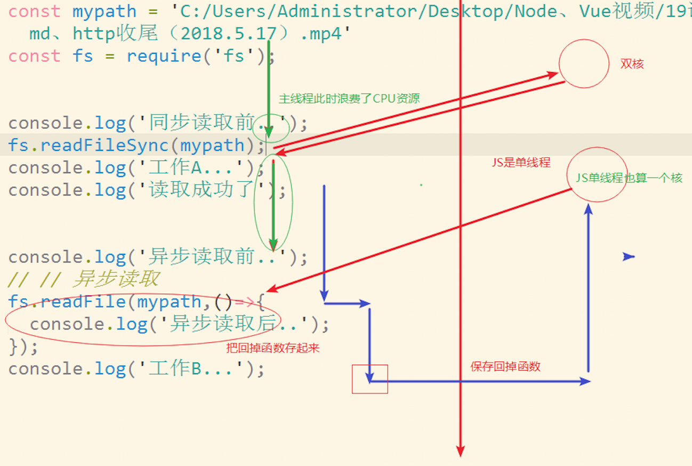
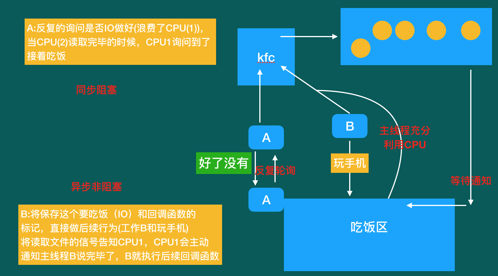
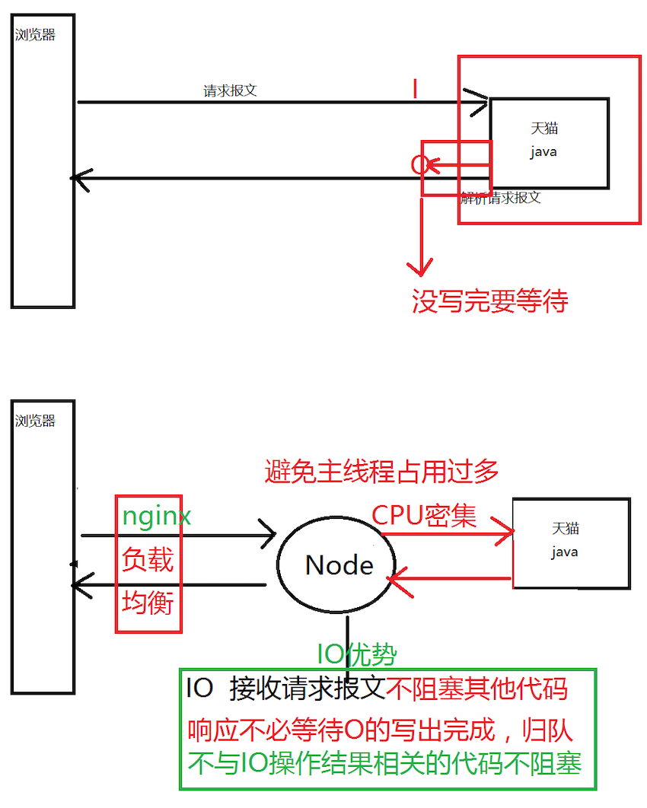

### 为什么学习Node?

- IO优势
  1. 对于文件读写,Node采用的是非阻塞IO
  2. __传统IO在读写文件的时候CPU来处理,而代码执行也处于等待中,浪费性能__
  3. __非阻塞IO将读写操作交给CPU,而代码正常执行,减少等待浪费的性能__
- 应用场景
  1. 实际应用: webpack/gulp/npm/http-server/json-server
  2. 服务器中负责IO读写的中间层服务器(天猫中间层IO服务器)

### NodeJS特点

* 其移植了chrome V8引擎,解析和执行代码机制和浏览器js相同
* 其沿用了JavaScript语法、另外扩展了自己需要的功能
* 总结: nodejs是一个后端语言，其具备操作文件的能力, 可以具备服务器的创建和操作能力
  * 其语法是JavaScript语法,代码运行在chrome V8 引擎之上

### 内置对象

#### 分类

1. 全局对象：何时何处都能访问
2. 核心对象：向系统索要，引入即可使用
3. 自定义对象：按路径引入即可

#### process(全局对象)

> process.env是一个对象，可以通过其属性名来获取具体的环境变量

> process.argv获取命令行参数

#### filename/dirname(全局对象)

> filename 获取当前运行文件的目录，绝对路径

> _dirname 获取运行文件的绝对路径

#### node实现规范

**CommonJS**规范JavaScript语言作为后端语言运行的标准

- 具备什么能力，该怎么做，比如：具备服务器的能力/可以操作文件 process.kill(pid)
- 模块该怎么写：Module
  - 依赖一个模块 require('模块名(id)')
  - 需要被模块依赖 module.exports = 给外部的数据
  - 一个文件是一个模块

#### 核心对象path

`const path = require('path')`

**路径 -> 在处理路径的时候很擅长,但是,其不负责判断路径是否存在文件**

> **拼接并修改路径** `path.join(__dirname,'a','b');` 以当前目录/a/b

> ``path.resovle('./xxx')``  相对路径转绝对路径

接收一个合法的路径字符串，转换成一个对象 `let pathObj = path.parse(mypath);`

接收一个路径对象，转换成一个字符串路径 `let str = path.format(pathObj);`

### fs文件模块

- 文件读写
- 其他功能
- 扩展介绍

#### 操作文件对象

> IO-->I :input输入; O:output 输出;  文件的操作就是IO

```js
const fs = require('fs'); //必须这个名称
//读 
fs.readFile(路径,回调函数);
//写 
fs.writeFile(路径,数据,回调函数);
```





