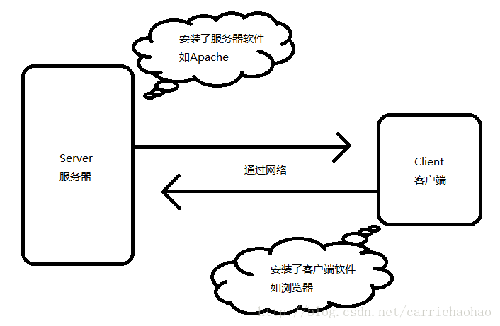

## HTTP服务

### CS 架构

 

```
在C/S结构的情况下，不同的服务需要安装不同的客户端软件，比如QQ、迅雷、Foxmail这种情况下安装的软件会越来越多，进而占用非常多的系统资源，除此之外还有其它弊端，比如A出差，需要在B电脑上查收邮件，但是B电脑并未安装Foxmail等类似的客户端软件，这样不得不先去下载Foxmail，非常不方便，并且客户端软件升级后也需要重新下载。
相对安全。客户端是自己编写的
基于安装包的形式，性能会很高
```

### bs 架构

```
B/S（即Broswer、Server）解决了C/S所带来的不便，将所有的服务（如QQ、邮件等）都可以通过浏览器来完成，因为基本所有浏览器都安装了浏览器，这样可以更多的节省系统资源，并且功能升级也无需重新下载，只要刷新网页即可，要但B/S也有一些不利，比如操作稳定性、流畅度等方面相对较弱。
```

## 客户端

```
具有向服务器索取服务能力的终端，如比如手机、电脑等，通过安装不同的客户端软件，可以获取不同的服务，
比如通过QQ获得即时通讯服务、通过迅雷获得下载服务等。常见的客户端软件：浏览器、QQ、迅雷、Foxmail等。
以浏览器为宿主环境，结合 HTML、CSS、Javascript等技术，而进行的一系列开发，通常称之为前端开发。
```

## 服务端

通俗的讲，能够提供某种服务的机器（计算机）称为服务器。

### 服务器类型

按照不同的划分标准，服务可划分为以下类型：

1、按服务类型可分为：文件服务器、数据库服务器；

2、按操作系统可分为：Linux服务器、Windows服务器等；

3、按应用软件可分为 Apache服务器、Nginx服务器、IIS服务器、Tomcat服务器、Node服务器等；

### 服务器软件

使计算机具备提供某种服务能力的应用软件，称为服务器软件，通过安装相应的服务软件，然后进行配置后就可以使计算具备了提供某种服务的能力。

常见的服务器软件有：

1、文件服务器：Server-U、FileZilla、VsFTP等；

2、数据库服务器：Oracle、MySQL、PostgreSQL、MSSQL等；

3、邮件服务器：Postfix、Sendmail等；

4、web服务器：Apache、Nginx、IIS、Tomcat、NodeJS等；

### Web服务器

即网站服务器，主要提供文档(文本、图片、视频、音频)浏览服务，一般安装Apache、Nginx服务器软件。

HTTP服务器可以结合某一编程语言处理业务逻辑，由此进行的开发，通常称之为服务端开发。

常见的运行在服务端的编程语言包括PHP、Jsp、Asp、Python、Ruby, go等。

## 网络基础 

### IP 地址

所谓IP地址就是给每个连接在互联网上的主机分配的一个32位地址。(就像每部手机能正常通话需要一个号码一样)

查看本机IP地址 ping、ipconfig、ifconfig

公网ip，局域网ip

### 域名

由于IP地址基于数字，不方便记忆，于是便用域名来代替IP地址，域名是一个IP地址的“面具”

查看域名对应的IP地址 ping、tracert。

### DNS服务

DNS记录了 IP 地址和域名的映射（对应）关系；

查找优先级 本机hosts文件、DNS服务器。

### 端口

端口号是计算机与外界通讯交流的出口，每个端口对应不同的服务。

现实生活中，银行不同的窗口办理不同的业务。

查看端口占用情况 netstat -an。

常见端口号 80、8080、3306、21、22。

### 静态资源 与动态资源

静态资源：可以直接被浏览器解析的资源我们称为静态资源，比如html,javascript,css,video等。

动态资源:动态资源在服务器被解析，可以被转换为静态资源。 php jsp asp

区别：如果客户端浏览器访问的是静态资源，那服务器接收到请求后，会直接将静态资源响应给客户端。

如果客户端浏览器访问的是动态资源，那么服务器接收到请求后会将动态资源转换成静态资源，然后进行响应。

## php 编程

**避免使用中文目录和中文文件名**

### php 变量

1、变量以$开头 字母/数字/下划线 不能以数字开头

2、大小写敏感（区分大小写）

### 数据类型

字符型、整型、浮点型、布尔型、数组、

索引数组、关联数组（了解即可）

### 内容输出

echo：输出简单数据类型，如字符串、数值

print_r()：输出复杂数据类型，如数组

var_dump()：输出详细信息，如对象、数组（了解）

### 运算符

基本与Javascript语法一致

.号表示字符串拼接符，Javascript中为+号。

### 函数

与Javascript基本一致函数名对大小写不敏感默认参数（了解即可）。

### 分支 循环语句

与Javascript基本一致foreach()

### 表单处理

表单name属性的是用来提供给服务端接收所传递数据而设置的

表单action属性设置接收数据的处理程序

表单method属性设置发送数据的方式

当上传文件是需要设置`enctype="multipart/form-data"`，且只能`post`方式

`$_GET`接收`get`传值

`$_POST`接收`post`传值

`$_FILES`接收文件上传

### 常用PHP函数

in_array() 是否在数组中

```php
$arrs=array("1","2","3");
//判断1 这个元素是否存在$arrs 这个数组当中。
echo in_array("1",$arrs);
```

count() 计算数组长度

```php
$arrs=array("1","2","3");
count($arrs);
```

array_key_exists ()检测数组中是否存在key

```php
 $arrs=array("username"=>"张三","age"=>11);
echo array_key_exists("username",$arrs);
```

file_get_contents读取文件

...还有很多

```php
$data=file_get_contents("hello.txt");
echo $data;
```

```php
$data=$_FILES[**"lifephoto"**];
*// var_dump($data);**//**获取到**apache* *临时存储的文件**.*$file=$data[**"tmp_name"**];
//获取到文件名 $fileName=$data[**"name"**];
**move_uploaded_file**($file,**"images/"**.$fileName);
```

## 数据库

###  数据库基础知识

数据库：存储数据的仓库

内存存储

​	数据无法持久化

​	无法保存大量的数据

文件存储

​	速度太慢，无法忍受

​	很难确定数据的结构以及关系，增加、删除、修改麻烦，需要你自己按照一种固定的方式

​	不安全，随便一个人都能打开你的文件

###数据库概述

- **数据结构化**

- **实现数据共享**
 

不是为某一个用户存储特定的数据

- 可以减少冗余数据

- 数据独立性高

- 数据统一管理与控制 

### 数据结构化

数据库就是用来存储数据的。

电子化的文件柜——存储电子文件的处所

一个容器。

就是用来存储电子化的数据的

数据库管理系统（DataBase Management System，DBMS）：

为管理[数据库](https://zh.wikipedia.org/wiki/%E6%95%B0%E6%8D%AE%E5%BA%93)而设计的大型电脑[软件](https://zh.wikipedia.org/wiki/%E8%BD%AF%E4%BB%B6)管理系统

[Oracle](https://zh.wikipedia.org/wiki/Oracle)、[Microsoft SQL Server](https://zh.wikipedia.org/wiki/Microsoft_SQL_Server)、[Access](https://zh.wikipedia.org/wiki/Access)、[MySQL](https://zh.wikipedia.org/wiki/MySQL)及[PostgreSQL](https://zh.wikipedia.org/wiki/PostgreSQL)

数据库应用程序（DataBase Application）：

其实就是一些图形化管理界面的GUI软件，来操作数据库管理系统管理我们的数据

### 数据库存储结构

一个数据库服务器可以管理多个数据库，通常情况下开发人员会针对每个应用创建一个数据库，为保存应用中实体的数据，会在数据库中创建多个表（用于存储和描述数据的逻辑结构），每个表都记录着实体的相关信息。

一个数据库服务器中可以有多个数据库

一个数据库当中可以有多张表用来存储数据

一个表中可以用来存储多条记录

### SQL 语言

SQL（Structure Query Language）：结构化查询语言

是一种数据库**查询语言**。

SQL语言是一个标准。由一个规范组织提出和维护的。

市面上常见的数据库基本都支持SQL查询语言。

#### DDL

l 数据定义语言（Data Definition  [ˌdefɪˈnɪʃn]  Language）简称**DDL**

数据库定义语言主要用于定义数据库、表等，其中包括：

CREATE  语句用于创建数据库、数据表等

ALTER   语句用于修改表的定义等

DROP    语句用于删除数据库、删除表等

### DML

l 数据操作语言（Data Manipulation [məˌnɪpjʊ'leɪʃn] Language）简称DML

数据操作语言主要用于对数据进行添加、修改和删除操作，其中包括：

INSERT 语句用于插入数据

UPDATE 语句用于修改数据

DELETE 语句用于删除数据

####DQL

l 数据查询语言（Data Query Language）简称DQL

数据查询语言主要用于查询数据，也就是SELECT语句，使用SELECT 语句可以查询数据库中一条数据或多条数据

数据库中的操作都是通过SQL语句来完成的，而且在应用程序中也经常使用SQL语句，例如在Node.js中嵌入SQL语句，通过执行JavaScript语言来调用SQL语句，就可以完成数据的插入、修改、删除、查询等操作。

SQL语句还可以嵌入到其它语言中，如Java、PHP等。

### 常见的数据库产品

####Orcale数据库

Orcale数据库管理系统由**甲骨文公司**开发，在数据库领域一直处于领先地位。

大型的商业型数据库，目前国内一些大公司在用，国企

淘宝、京东等都有使用，一个很老牌的数据库，稳定

####SqlServer数据库

由微软公司开发，只能在Windows上运行。.net程序员。

但是，微软现在已经把SqlServer移植到了别的平台，例如：Linux

#### DB2数据库

由IBM公司开发，在**金融行业**中使用的比较多。IBM的服务器，买服务器送数据库。

IBM靠硬件发家的，小型机。小型服务器

比较稳定

####MySQL数据库

MySQL数据管理系统由瑞典的MySQLDB公司开发，但是几经辗转，现在已经是Oracle的产品了。

开源、免费、轻量

MySQL具有跨平台的特性，不仅可以在Windows平台上使用，还可以在Unix、Linux和Mac OSX平台上使用。

相对其它数据库而言，MySQL的使用也更加方便、快捷而且MySQL免费所以**运营成本低**，因此很多公司都在用MySQL。

Oracle收购过来之后，发行了两个版本：

​	一个是企业版，公司买了之后，Oracle公司可以提供一些服务，例如数据恢复，或者说存储数据出现了问题

​	一个社区版，也就是免费开原版

#### MongoDB数据库

mongodb是一种非关系型数据库，简称NoSQL

存储方式，不是数据库-表-记录了

mongod的存储方式是：数据库-集合-实体（随便存储，就像json对象一样）

MongoDB是由10gen公司开发的一个介于关系型数据库和非关系型数据库之间的产品，是非关系型数据库中功能最丰富，最像关系型数据库的。他支持的数据结构非常松散，是类似json的格式，所以可以存储比较复杂的数据结构类型。

MongoDB数据库管理系统最大的特点就是它支持的查询语言非常强大，语法类似于面向对象的查询语言。它还是一个开源的数据库，对于大数据量、高并发的互联网应用，支持非常不错。

操作非关系型数据库不需要使用SQL语言
